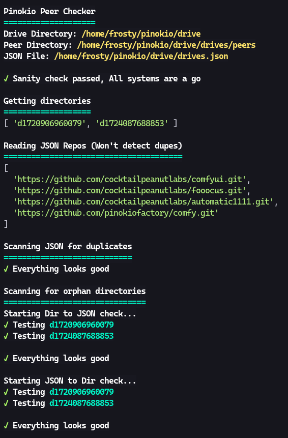

# Peers-Check
This is not for everyone, It's primary purpose is for debugging. 
Creating and testing installers can create multiple entries this will help you clean things. 

- Checks for a valid json
- Checks for duplicate entries
- Checks your drive/drives.json file against the physical directories
- Checks your physical directories against the json file

Just extract to your Pinokio directory and it will find all the files automatically.  
== Non-destructive, displays information only, it's up to you to fix things. ==

### Install
put this entire directory under your Pinokio directory

### Screenshot

